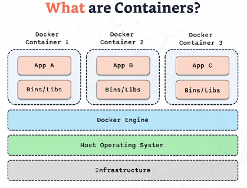

# Docker

What is Docker? Simply, Docker is a `lightweight way to set up and run applications without having to create the entire infrastructure for them`. For example, with a traditional Virtual Machine (VM) built to host an application, you need the OS, libraries, and dependencies, all of which make it quite heavy and resource-intensive. 

Docker, on the other hand, allows you to package your application along with its dependencies into containers. These containers are isolated and can run on any system that supports Docker, without the overhead of running a full-blown operating system. 

This makes Docker an `efficient, portable, and scalable solution` for application deployment, ideal for modern development workflows like DevOps and microservices architecture.

## What Are Containers?

The image below is all about showing how containers work. At the top, you see three different Docker containers—each running a different application: App A, App B, and App C.

**What’s inside a container?**  
Each of these containers has two main parts:

The App itself (so whatever software or service you’re running).
Bins/Libs (basically, all the dependencies, libraries, and binaries the app needs to run smoothly).

**What about the Docker engine?**  
Below the containers, we’ve got the Docker Engine. This is like the brain behind the operation. It’s what makes sure each container runs independently but still shares resources with the system efficiently. Think of it as the glue that holds everything together without slowing things down.

**The Host OS and Infrastructure**  
Going further down, we see the Host Operating System (the main OS where Docker is installed) and the Infrastructure (the actual hardware, servers, or cloud platform that everything is running on).

As you can see from this, `containers don’t need their own OS` which is a big. That’s why containers are `much lighter`compared to something like a Virtual Machine, which would have to run an entire OS for each application.

